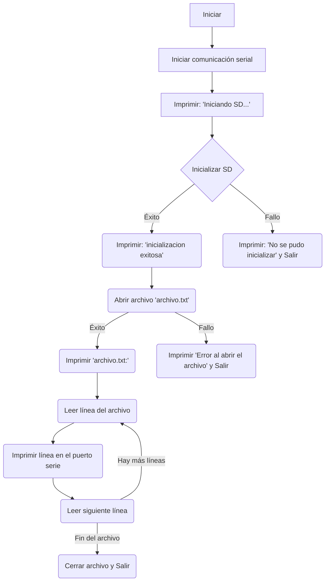

# PRACTICA 6 :  Buses de comunicación II (SPI)  

El objetivo de la practica es comprender el funcionamiento del bus spi 
Alumna : **Àfrica Abad**

## Ejercicio Practico 1  LECTURA/ESCRITURA  DE MEMORIA SD

1. Descibir la salida por el puerto serie 

Por el puerto serie saldrá primero :
     Iniciando SD ...

Para indicar que el proceso de inicialización de la tarjeta SD está en curso.

Si la inizialización de la tarjeta SD ha sido exitosa, se imprime:

    Inicialización exitosa.

En caso contrario:

    No se pudo inicializar.

Si la tarjeta SD se inicializa correctamente y el archivo "archivo.txt" se abre sin problemas, el programa imprimirá el contenido del archivo línea por línea a través del puerto serie a una velocidad de 112500 baudios. Cada línea del archivo se imprimirá en el puerto serie hasta que se haya leído todo el contenido del archivo.

Si hubiera algun error para abrir el fichero saldría:

    Error al abrir el archivo.

-----
2. Explicar el funcionamiento 

El código es un programa que utiliza una tarjeta SD para leer un archivo llamado "archivo.txt" y mostrar su contenido a través del puerto serie.

1. Inclusión de bibliotecas: Al principio del código, se incluyen las bibliotecas `SPI.h` y `SD.h`. Estas bibliotecas son necesarias para la comunicación con la tarjeta SD a través del bus SPI (Serial Peripheral Interface).

2. Declaración de variables globales: Se declara una variable global `myFile` del tipo File. Esta variable se utilizará para interactuar con el archivo en la tarjeta SD.

3. Función `setup()`: 
Se inicializa la comunicación serial a una velocidad de 112500 baudios mediante `Serial.begin(112500)`.
Se imprime "Iniciando SD ..." en el puerto serie para indicar que el proceso de inicialización de la tarjeta SD está en curso.
Se intenta inicializar la tarjeta SD utilizando `SD.begin(4)`, donde el argumento 4 representa el pin CS (Chip Select) de la tarjeta SD.
Si la inicialización de la tarjeta SD es exitosa, se imprime "inicializacion exitosa" en el puerto serie. De lo contrario, se imprime "No se pudo inicializar" y la función `setup()` termina.
Si la inicialización de la tarjeta SD es exitosa, se intenta abrir el archivo "archivo.txt" en modo lectura `(SD.open("archivo.txt"))`. Si el archivo se abre correctamente, se imprime "archivo.txt:" en el puerto serie.
Se lee y se imprime el contenido del archivo línea por línea hasta que se haya leído todo el contenido.
Finalmente, se cierra el archivo con `myFile.close()`.
4. Función `loop()`: Esta función se ejecuta continuamente después de que `setup()` ha terminado. Sin embargo, en este programa, la función `loop()` está vacía, por lo que no realiza ninguna tarea específica.

### Diagrama de flujo

 
 

