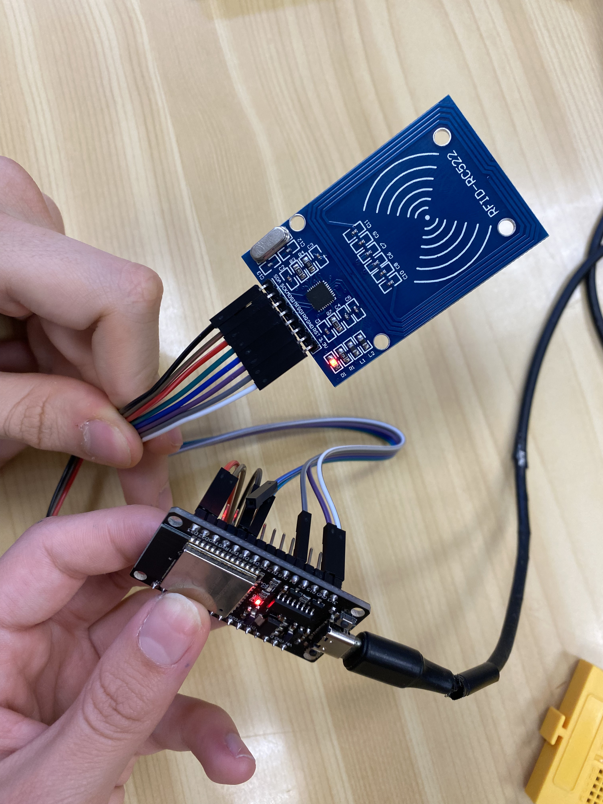

# PRACTICA 5 :  Buses de comunicación II (SPI)  

El objetivo de la practica es comprender el funcionamiento del bus spi 
Alumnos: **Bernat Rubiol i Àfrica Abad**


## Ejercicio Practico 2 LECTURA DE ETIQUETA RFID 

  
|        | Pin    | Color cable |
|--------|--------|-------------|
| SCK    | 22     | Marro       |
| MISO   | 19     | Verd        |
| MOSI   | 23     | Vermell     |
| SS     | 21     | Negre       |
| RESET  | 4      | Gris        |
| GND    | GND    | Lila        |
| 3V3    | 3V3    | Blanc       |


MOSI (Master Output Slave Input): salida de datos del Master y entrada de datos al Esclavo.

MISO (Master Input Slave Output): Salida de datos del Esclavo y entrada al Master.


1. Descibir la salida por el puerto serie 


2. Explicar el funcionamiento 


- Inicio del programa:
El programa comienza inicializando la comunicación serial y el bus SPI, necesario para comunicarse con el lector RFID MFRC522.

- Bucle principal:
El programa entra en un bucle infinito donde continuamente verifica si hay una nueva tarjeta RFID presente.

- Verificación de nueva tarjeta:
Se verifica si hay una nueva tarjeta RFID presente utilizando la función `mfrc522.PICC_IsNewCardPresent()`.

- Lectura del UID:
Si se detecta una nueva tarjeta, se procede a leer su UID utilizando la función `mfrc522.PICC_ReadCardSerial()`.

- Envío del UID por el puerto serie:
Una vez leído el UID, se envía por el puerto serie utilizando la función `Serial.print()`. Esto permite visualizar el UID en la consola serial para propósitos de depuración y verificación del funcionamiento.

- Finalización de la lectura de la tarjeta:
Después de completar la lectura del UID de la tarjeta, se finaliza la lectura de la tarjeta actual con la función `mfrc522.PICC_HaltA()`.

- Repetición del proceso:
Después de completar todas las operaciones, el programa vuelve al inicio del bucle para repetir el proceso y seguir leyendo tarjetas RFID.


3. fotos del montaje 





4. salidas de depuracion ( print...)

El código utiliza la función `Serial.print()` para mostrar el UID de la tarjeta detectada a través del puerto serie. Esto permite depurar y verificar el funcionamiento del programa.

5. codigo generado 

```cpp
User
#include <Arduino.h>
#include <SPI.h>
#include <MFRC522.h>

#define RST_PIN	4    //Pin 9 para el reset del RC522
#define SS_PIN	21   //Pin 10 para el SS (SDA) del RC522
//Conectem els pins de mosi i miso
MFRC522 mfrc522(SS_PIN, RST_PIN); //Creamos el objeto para el RC522

void setup() {
	Serial.begin(112500); //Iniciamos la comunicación  serial
	SPI.begin(22,19,23);        //Iniciamos el Bus SPI
	mfrc522.PCD_Init(); // Iniciamos  el MFRC522
	Serial.println("Lectura del UID");
}

void loop() {
	// Revisamos si hay nuevas tarjetas  presentes
	if ( mfrc522.PICC_IsNewCardPresent()) 
        {  
  		//Seleccionamos una tarjeta
            if ( mfrc522.PICC_ReadCardSerial()) 
            {
                  // Enviamos serialemente su UID
                  Serial.print("Card UID:");
                  for (byte i = 0; i < mfrc522.uid.size; i++) {
                          Serial.print(mfrc522.uid.uidByte[i] < 0x10 ? " 0" : " ");
                          Serial.print(mfrc522.uid.uidByte[i], HEX);   
                  } 
                  Serial.println();
                  // Terminamos la lectura de la tarjeta  actual
                  mfrc522.PICC_HaltA();         
            }      
	}	
}
```

---
### ADDICIONAL
Una vez hecha esta práctica me puse a investigar un poco más sobre esta librería y vi que se pueden hacer muchas más cosas aparte de leer y escribir ficheros, como crear directorios, renombrar los archivos... Esto mezclado con otras librerías como por ejemplo la de anteriores prácticas para hacer un servidor con la misma ESP32, podría ser útil para crear un servidor de ficheros para poder acceder desde la misma red local. 
 
 

 
 


